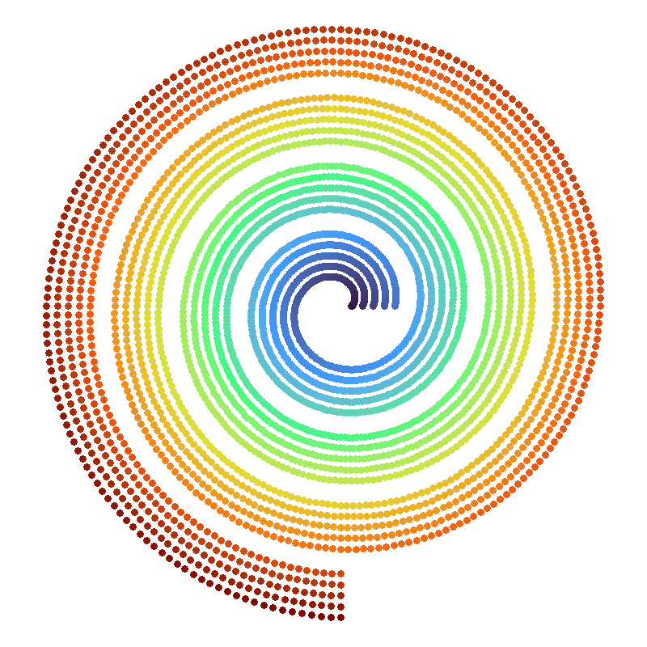

--- 
title: "Introduction to the masmr project"
author: "Eugene Kwa"
date: "`r Sys.Date()`"
site: bookdown::bookdown_site
documentclass: book
bibliography: [book.bib, packages.bib]
# url: your book url like https://bookdown.org/yihui/bookdown
cover-image: "./images/masmr.png"
description: |
  This is a quick introduction to building piplines for MERFISH decoding using our masmr package.
link-citations: TRUE
github-repo: rstudio/bookdown-demo
---

# About `masmr`

```{r index-image, echo=FALSE, fig.align='center', out.width='70%'}

```

This book provides a quick introduction to `masmr: Modular Algorithms for Spotcalling in MERFISH in R`.

The `masmr` package is designed to allow users to build custom image processing pipelines, with a focus on MERFISH decoding.

For queries / comments, kindly direct them to Eugene Kwa (<kwaje@gis.a-star.edu.sg>). 

## Installation 

Currently, this package is hosted on GitHub:

[https://github.com/eugenekwaNeuromics/masmr/](https://github.com/eugenekwaNeuromics/masmr/).

Installation should be achievable with the `devtools` package:

```{r howtoinstall, eval=FALSE}
devtools::install_github('eugenekwaNeuromics/masmr')
```

Currently depends on the following packages:

* `ggplot2`, `scales`, `reshape2`, `viridis`: for plotting.
* `data.table`: for quick reading and writing of data files.
* `RBioFormats`: for reading a variety of microscopy image formats.
* `imager`, `EBImage`: for image processing functions.
* `tripack`: for triangular meshing functions.
* `reticulate`: for interfacing with Python (used during cell segmentation).
* `parallel`: for getting number of cores on machine.
* `Rcpp`, `RcppEigen`: for functions written in C++.
* `igraph`: for clustering.
* `rlang`: for parsing arguments.

```{r index-biblio, include=FALSE}
# automatically create a bib database for R packages
library(masmr)
knitr::write_bib(c(
  .packages(), 
  'ggplot2', 'viridis', 'data.table', 'RBioFormats', 'imager', 'EBImage', 'tripack', 
  'reticulate', 'parallel', 'Rcpp', 'RcppEigen',
  'scales', 'reshape2', 'igraph', 'rlang'
), 'packages.bib')
```
